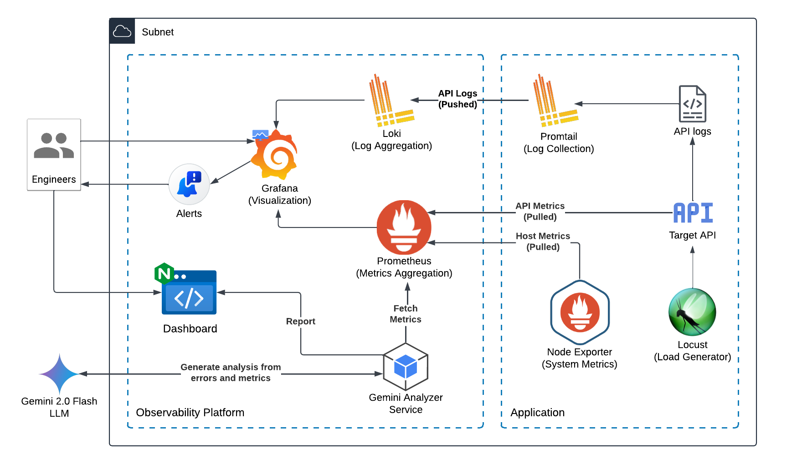

# Observ: Simple and Comprehensive API Observability Suite

> Comprehensive observability solution with LLM based error analysis for simulated APIs

## Overview



- The **Application Node** consists of a **containerized API** which is simulated to generate errors randomly using **Locust’s** load generation utility. The Prometheus Python library is used to define custom application specific metrics (Counters, Histograms) which are exposed by it as well. 
- The logs are collected by **Promtail** by parsing the API’s log files with predefined labels  later used for filtering. A **Prometheus Node Exporter** also collects system metrics from the host node and exposes them. 
- The **Observability Platform Node** consists of **Prometheus** which pulls API specific and system metrics whereas **Loki** stores API logs pushed by **Promtail**. 
- **Grafana** is used to create dashboards to visualize important trends by querying Loki and Prometheus metrics and logs using various filters and trigger alerts to emails based on predefined thresholds.
- An **Analyzer service** also running on the Observability Node is responsible for preparing error breakdown reports and conduct AI based historical analysis of metrics and frequent errors by querying API specific stats from Prometheus.
- The **Gemini 2.0 Flash LLM** along with a well defined analytics oriented prompt is used to produce an overview on the errors and exceptions along with helpful recommendations for fixes and performance improvement. 
- These reports are sent to a static dashboard page served over **NGINX** for engineers to quickly catch up, prioritize and act on the most pressing issues.

## Prerequisites

- Docker and Docker Compose
- Gemini API Key

## Folder Structure
```
.
├── README.md
├── api-host
│   ├── api
│   │   ├── Dockerfile
│   │   ├── app.py
│   │   ├── pyproject.toml
│   │   ├── requirements.txt
│   │   └── uv.lock
│   ├── docker-compose.yml
│   ├── locust
│   │   └── locustfile.py
│   └── promtail
│       └── config.yml
├── assets
│   └── arch.png
└── observability-host
    ├── analyzer
    │   ├── Dockerfile
    │   ├── app.py
    │   ├── pyproject.toml
    │   ├── requirements.txt
    │   └── uv.lock
    ├── docker-compose.yml
    ├── env.example
    ├── frontend
    │   └── index.html
    ├── grafana
    │   ├── dashboards
    │   │   └── dashboard.json
    │   └── datasources
    │       └── datasources.yml
    ├── nginx
    │   └── nginx.conf
    └── prometheus
        └── prometheus.yml

13 directories, 22 files
```

## Setup

1. Clone the repository. Run the web server (optional).

```bash
git clone https://github.com/SourasishBasu/batterhorse.git
cd batteryhorse
```

2. Create a `.env` file following the `env.example` in the both subdirectories and place the API keys and respective URLs into it.

3. Run the Docker Compose configs from the project root directory.

```bash
cd api-host && docker compose up -d --remove-orphans --build
cd observability-host && docker compose up -d --remove-orphans --build
```

## Usage

- Locust automatically makes requests every second or 2 which populates log file, and generates exceptions in the API responses with random chance. 

- Promtail will automatically push logs to Loki, and Prometheus auto scrapes metrics from node exporter (Linux specific) and Flask API.

- Grafana consists of a premade dashboard which has panels with promql and loki queries for key trends' visualization and monitoring.

- Report dashboard can be made to simulate API errors and generate report on analysis of stats and metrics from Prometheus generated within last 20 minutes(configurable on `observability-host/analyzer/app.py`).

### Routes

- Grafana dashboard [`User: admin`, `Password: admin123`]: `<host-ip>:3000/` 
- Flask Simulation API: `<host-ip>:5000` 
- Analyzer service API: `<host-ip>:5001`
- Report Dashboard: `<host-ip>`


Deployement and testing performed on 2x 2 vCPU, 4GB RAM server on DigitalOcean.